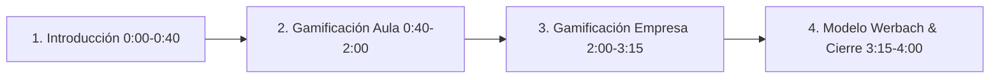

# Guion Técnico de Grabación para el Video de la Actividad

Este documento contiene el guion paso a paso preparado para que grabes tu video demostrativo cumpliendo de manera exacta con cada uno de los 9 criterios de la **Rúbrica de Evaluación (36/36 pts)** y la fundamentación del **Modelo Teórico de Kevin Werbach**.

---

## 🧭 Estructura del Video (Duración recomendada: 3 a 5 minutos)

---

### 1. Introducción y Contexto (0:00 - 0:40)
- **Visual en pantalla:** Mostrar la aplicación en vivo con el branding de la Universidad del Desarrollo: [https://eldonconc.github.io/gamificacion-app/](https://eldonconc.github.io/gamificacion-app/)
- **🎙️ Qué decir:**
  > *"Buenas tardes profesora y compañeros. En este video presentamos nuestra actividad de gamificación para el curso de Herramientas Tecnológicas, Innovación y Creatividad de la Universidad del Desarrollo. Nuestra propuesta aborda las dos dimensiones solicitadas en la pauta: en primer lugar, una experiencia gamificada para el **Aula** en la carrera de Psicología, y en segundo lugar, una propuesta de gamificación para una **Empresa** de nuestra invención llamada MindPulse Workspace."*

---

### 2. Parte 1: Gamificación en el Aula (Psicología UDD) (0:40 - 2:00)
- **Visual en pantalla:** Pestaña 1 (**SIMULADOR CLÍNICO TCC**).
- **🎙️ Qué decir (Punto por punto según la rúbrica):**

  1. **Finalidad del aprendizaje (Rúbrica Criterio 1):**
     > *"En el aula, elegimos la carrera de Psicología en el área de Terapia Cognitivo-Conductual (TCC). La finalidad pedagógica es motivar a los estudiantes y facilitar el aprendizaje significativo en la detección de distorsiones cognitivas, pasando de la memorización pasiva a la toma de decisiones clínicas activas."*

  2. **Elección de Plataforma (Rúbrica Criterio 2):**
     > *"Diseñamos un simulador web interactivo basado en las dinámicas de Nearpod y Breakout EDU. Elegimos este formato porque permite presentar casos ramificados y feedback reflexivo inmediato, excluyendo Kahoot para priorizar el análisis clínico sobre la velocidad."*

  3. **Mecánicas y Dinámicas (Rúbrica Criterio 3):**
     > *"Como mecánicas implementamos: 3 Oportunidades/Vidas (❤️), Puntos Clínicos (XP) y Racha de aciertos (🔥). Como dinámica central aplicamos la Progresión de Estatus, donde el alumno avanza de 'Interno Novato' a 'Terapeuta Senior' mediante una narrativa inmersiva de casos reales."*

  4. **2 Ideas del Decálogo de Gamificación (Rúbrica Criterio 4):**
     > *"Integramos 2 ideas clave del decálogo:  
     > • **Idea 02 (Segundas y terceras oportunidades):** Si el estudiante comete un error, el sistema no lo bloquea: le entrega una pista reflexiva y le permite reintentar el caso usando una vida.  
     > • **Idea 03 (Feedback instantáneo):** Inmediatamente al seleccionar una respuesta, el sistema explica el fundamento clínico de la opción."*

- **Demostración en vivo:** Responder 1 caso en pantalla para mostrar el feedback instantáneo, el funcionamiento de las vidas y el guardado de datos.

---

### 3. Parte 2: Gamificación en la Empresa (MindPulse Workspace) (2:00 - 3:15)
- **Visual en pantalla:** Cambiar a la Pestaña 2 (**MINDPULSE WORKSPACE**).
- **🎙️ Qué decir (Punto por punto según la rúbrica):**

  1. **Descripción de la Empresa (Rúbrica Criterio 5):**
     > *"Para la parte corporativa creamos **MindPulse Tech**, una empresa SaaS B2B de desarrollo de software y consultoría en salud mental laboral para equipos remotos y de alta exigencia."*

  2. **Finalidad de la Gamificación (Rúbrica Criterio 6):**
     > *"La finalidad empresarial es **reducir la rotación voluntaria de talento en un 35% y prevenir el síndrome de Burnout**, incrementando el clima laboral y la productividad sostenible."*

  3. **Comportamiento a Modificar (Rúbrica Criterio 7):**
     > *"El comportamiento crítico a modificar es el sobretrabajo continuo sin descansos y el ocultamiento del estrés. Buscamos instalar el hábito diario de realizar micro-pausas activas de mindfulness y registrar el estado de ánimo al iniciar el turno."*

  4. **2 Mecánicas / Dinámicas aplicadas (Rúbrica Criterio 8):**
     > *"Aplicamos dos mecánicas principales:  
     > • **Mecánica 1 - Puntos ZenXP y Tienda de Recompensas:** Acumulación de puntos por hábitos de autocuidado, canjeables por tardes libres de desconexión o bonos saludables.  
     > • **Mecánica 2 - Misiones de Escuadra y Kudos:** Dinámica cooperativa donde los equipos suman puntos conjuntos en el ranking semanal y se envían reconocimientos sociales mutuos."*

- **Demostración en vivo:** Hacer clic en "COMPLETAR (+50 XP)" en una micro-pausa, marcar un estado de ánimo en el check-in y mostrar cómo se descuentan los puntos al canjear una recompensa.

---

### 4. Modelo Teórico de Kevin Werbach y Cierre (3:15 - 4:00)
- **Visual en pantalla:** Vista general y footer con logo UDD.
- **🎙️ Qué decir (Requisito de Entrega - Modelo Teórico):**
  > *"Como respaldo metodológico, toda la solución se fundamenta en el **Modelo de Diseño de Kevin Werbach (Marco de las 6D y Pirámide D-M-C)**:*
  > 
  > *1. **Definimos objetivos de aprendizaje y de negocio claros.**  
  > *2. **Delineamos los comportamientos objetivo** (diagnóstico clínico en el aula y pausas activas en la empresa).*  
  > *3. **Estructuramos bucles de actividad** de acción, retroalimentación y refuerzo.*  
  > *4. **Articulamos la Pirámide D-M-C:**  
  > • **Dinámicas:** Progresión de estatus y relaciones sociales (Kudos).  
  > • **Mecánicas:** Desafíos clínicos, segundas oportunidades y cooperación por escuadras.  
  > • **Componentes:** Puntos (XP/ZenXP), vidas, insignias, catálogo de beneficios y rankings con persistencia en Supabase.*
  > 
  > *Con esto, cubrimos de forma rigurosa la totalidad de los 36 puntos de la rúbrica. Muchas gracias."*

---

## 📋 Checklist de Entrega para el Video y la Plataforma

| Requisito | Dónde se cumple en el video / entrega | Estado |
| :--- | :--- | :---: |
| **Finalidad del aprendizaje (Aula)** | Sección 2 (Diagnóstico TCC en Psicología) | ✅ |
| **Elección de la plataforma (Aula)** | Sección 2 (Simulador Nearpod/Breakout EDU, Kahoot excluido) | ✅ |
| **Mecánicas y dinámicas (Aula)** | Sección 2 (Vidas, XP, Rachas, Estatus) | ✅ |
| **2 Ideas básicas del Decálogo** | Sección 2 (Idea 02 y Idea 03) | ✅ |
| **Demostración de funcionamiento (Aula)** | Demostración en vivo en pantalla | ✅ |
| **Descripción de la empresa** | Sección 3 (MindPulse Tech SaaS B2B) | ✅ |
| **Finalidad de la gamificación (Empresa)** | Sección 3 (Reducción 35% rotación y Burnout) | ✅ |
| **Comportamiento a modificar (Empresa)** | Sección 3 (Pausas activas y check-in de estrés) | ✅ |
| **2 Mecánicas / Dinámicas (Empresa)** | Sección 3 (Puntos ZenXP/Canje y Kudos de escuadra) | ✅ |
| **Texto de acompañamiento en entrega** | Descripción teórica con el Modelo de Werbach | ✅ |
